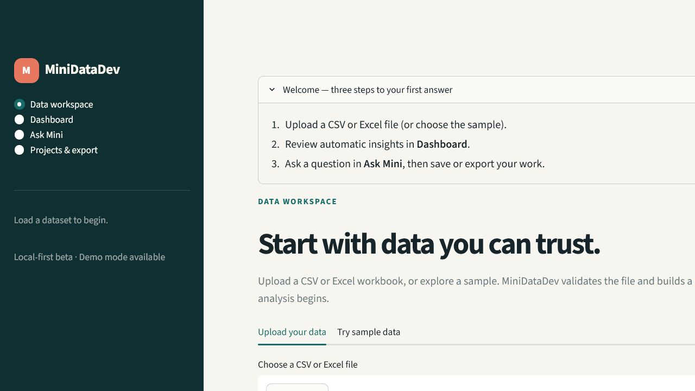
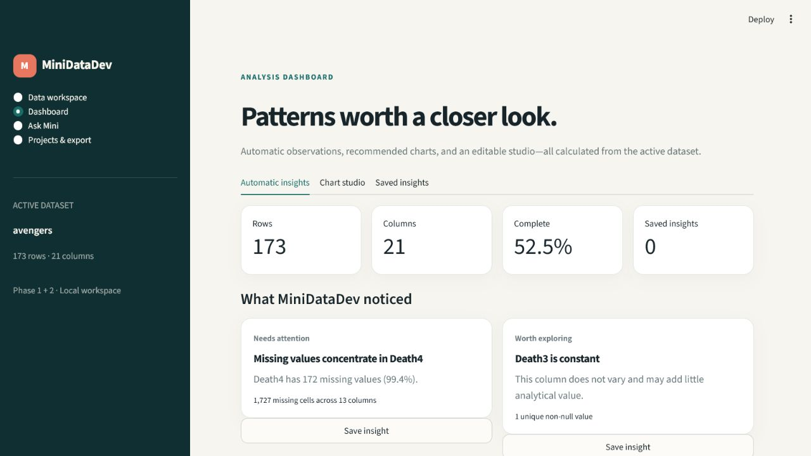

# MiniDataDev

MiniDataDev is an AI-assisted data-analysis workspace. Users can upload CSV or
Excel data, inspect automatic profiles and charts, ask analytical questions
conversationally, verify the calculations behind each answer, and export
results.

The current product includes the Streamlit workspace, schema-aware chatbot,
controlled analysis tools, and automated insight and visualization workflows.





## Technology

- Python 3.11+
- Streamlit
- Pandas, with DuckDB available for larger datasets
- Plotly
- Pydantic
- Local files and SQLite for initial persistence
- Pytest and Ruff for automated checks

## Local setup

1. Clone the repository and enter it:

   ```bash
   git clone https://github.com/CaptainThunderbird/MiniDataDev.git
   cd MiniDataDev
   ```

2. Create and activate a virtual environment:

   ```bash
   python -m venv .venv
   ```

   On macOS or Linux:

   ```bash
   source .venv/bin/activate
   ```

   On Windows PowerShell:

   ```powershell
   .venv\Scripts\Activate.ps1
   ```

3. Install the package and development tools:

   ```bash
   python -m pip install --upgrade pip
   python -m pip install -e ".[dev]"
   ```

4. Copy `.env.example` to `.env` and adjust local settings if needed:

   ```bash
   cp .env.example .env
   ```

   On Windows PowerShell, use `Copy-Item .env.example .env`.

5. Start the app:

   ```bash
   streamlit run app.py
   ```

6. Run the checks:

   ```bash
   ruff check .
   pytest
   ```

## Package layout

```text
src/minidatadev/
├── ai/          # provider and chatbot integration (later phases)
├── analysis/    # validated calculations and charts (later phases)
├── data/        # CSV/Excel loading and sample registry
├── projects/    # projects and conversation state (later phases)
└── config.py    # environment-backed configuration
```

## Product capabilities

- Upload and validate CSV, XLS, and XLSX files
- Load bundled or public sample datasets
- Preview data and inspect row, column, duplicate, and completeness metrics
- Explore automatic type and missing-value visualizations
- Retain the active dataset and conversation context within the session
- Stream schema-grounded answers through a provider-neutral assistant
- Filter, sort, aggregate, correlate, compare periods, and find outliers
- Generate verified Plotly charts through conversation
- Inspect the approved tool, parameters, assumptions, and calculation steps
- Review automatic quality, distribution, relationship, and structure insights
- Start from type-aware chart recommendations and edit every chart setting
- Ask Chat to explain the active chart using bounded plotted context
- Save observations and chart insights within the active dataset session
- Save and reopen local projects and their conversations
- Export cleaned CSV data or a portable HTML analysis package
- Apply configurable retention, deletion, and assistant usage limits
- Inspect local service health and structured operational event logs
- Use the offline demo assistant without credentials
- Optionally use OpenAI through the Responses API

The single supported data-loading API is:

```python
from minidatadev.data import DatasetLoader

loader = DatasetLoader()
frame = loader.load("path/to/data.csv")
```

Uploaded file objects can be loaded with
`loader.load(upload, filename=upload.name)`. Registered sample data can be
loaded by name, for example `loader.load("avengers")`.

### Loading, malformed data, and missing values

`DatasetLoader` accepts local paths, Streamlit upload objects, and allowlisted
sample names. It selects the parser from the validated `.csv`, `.xls`, or
`.xlsx` extension, tries UTF-8 CSV decoding first, and falls back to Latin-1.
Before Pandas parses a local or uploaded CSV, MiniDataDev checks that every
non-empty row has the header's field count. Inconsistent rows, parser errors,
unsupported extensions, unreadable files, and files without columns produce a
user-facing `DatasetLoadError`; malformed rows are never silently skipped.

Missing values are preserved as nulls rather than guessed or automatically
imputed. The profile reports missing counts and percentages per column and the
overall completeness rate. Each analysis operation then applies an explicit,
documented policy: descriptions report nulls separately, sorting places them
last, filters include or exclude them only through `is_null`/`not_null`,
grouping keeps null groups, correlations use Pandas pairwise exclusion, and
invalid dates are coerced to null before date comparisons. Any imputation or
row removal should be a deliberate, visible preprocessing step.

## Assistant configuration

The app starts in `demo` mode and requires no API key. Demo mode answers
questions about dataset shape, columns, and missing values.

To enable OpenAI, set these values in your uncommitted `.env`:

```dotenv
MINIDATADEV_AI_PROVIDER=openai
MINIDATADEV_AI_MODEL=gpt-5.6
OPENAI_API_KEY=your-local-key
```

The provider receives a bounded JSON context containing schema, profile,
three preview rows, and established conversation definitions. It does not
receive a dataframe object and cannot execute generated Python.

When OpenAI mode is enabled, the user's conversation, dataset name, schema and
column statistics, up to three preview rows (strings truncated to 120
characters), active filters/definitions/assumptions, and bounded active-chart
context are sent to the configured OpenAI model. The full dataframe and local
files are not sent by this application. Do not enable an external provider for
sensitive data unless that disclosure is permitted by the data owner and your
organization's policies.

## Controlled analysis tools

Analytical questions are mapped to an allowlisted operation. Every operation
uses a strict Pydantic request model, validates columns and types against the
active dataframe, and returns a bounded table or chart with provenance.

Available operations:

- `filter_data`
- `sort_data`
- `group_and_aggregate`
- `calculate_correlation`
- `describe_column`
- `find_outliers`
- `compare_periods`
- `create_chart`
- `preview_rows`

Common explicit questions are planned deterministically. When OpenAI is
enabled, the model may select one of the same approved tools for less regular
phrasing. Model-proposed arguments remain untrusted and pass through the same
local validation before execution. Arbitrary Python, SQL, and shell execution
are not available.

To limit misleading answers, common analytical questions are planned
deterministically; calculations run locally through named, allowlisted Python
functions; Pydantic validates parameters; column existence and types are
checked against the active dataframe; and results include the tool,
parameters, assumptions, and calculation provenance. Ambiguous or unsupported
requests should trigger clarification instead of a guessed calculation. The
offline benchmark checks numerical correctness, tool selection, chart values,
unsupported claims, malformed-data recovery, and prompt-injection resistance.
Model-written narrative should be treated as an explanation of verified
results, not as the source of truth.

## Automated insights and visualizations

The Dashboard derives observations deterministically from the dataset profile
and calculated statistics. Every observation includes evidence and, where
useful, an answerable suggested question.

The chart studio recommends visualizations based on detected column roles:

- category plus number → aggregated bar chart
- date plus number → time-series line chart
- two numbers → scatter plot
- one number → histogram and box plot
- category → record-count bar chart

Users can change chart type, axes, grouping, aggregation, and title. The active
chart publishes a bounded context containing its configuration, plotted row
count, small preview, and calculated high/low points. “Explain this chart”
answers use only that context.

## Reliability evaluation

Phase 5 includes a versioned benchmark dataset and ten evaluation cases
covering:

- numerical correctness
- condition-based record counts
- date-period comparisons
- correlation and missing-value questions
- chart type and aggregated values
- nonexistent columns and ambiguous requests
- prompt-injection attempts
- malformed CSV recovery

Run the suite locally:

```bash
python -m minidatadev.evaluation.runner \
  --output reports/evaluation.json \
  --minimum-pass-rate 1.0
```

The JSON report records pass rate, numerical and tool-selection accuracy,
chart correctness, unsupported-claim rate, recovery and safety rates, average
and p95 latency, token totals, and estimated cost. Cost remains `null` unless
current provider prices are explicitly supplied through:

```dotenv
MINIDATADEV_INPUT_PRICE_PER_MILLION=
MINIDATADEV_OUTPUT_PRICE_PER_MILLION=
```

CI runs the same suite and uploads `reports/evaluation.json` as a build
artifact. The benchmark is offline-first and does not spend API credits.

## Secrets

Never commit API keys or provider credential files. Local `.env`,
`kaggle.json`, and Streamlit secrets are ignored. Credentials belong in local
environment variables or a deployment platform's secret manager because Git
copies committed data into clones, forks, caches, and historical objects; a
later deletion does not make an exposed key secret again.

An exposed Kaggle credential was removed during Phase 0. Repository removal
does not revoke that key: its owner must revoke or rotate it from the Kaggle
account settings.

## Beta persistence and deployment

Phase 6 adds a local profile and SQLite project store. A profile name separates
projects on a shared installation; it is not production authentication. Saved
dataset copies, conversations, and event logs live under `.minidatadev/` and
are excluded from Git.

The **Projects & export** page supports project save/open/delete, retention
cleanup, cleaned CSV downloads, and ZIP analysis reports. See `PRIVACY.md`
before deploying with real user data.

`Dockerfile` and `render.yaml` provide a deployable beta configuration with a
persistent disk and Streamlit health check. Set `OPENAI_API_KEY` in the host's
secret manager, never in the repository.

## Roadmap

- Phase 0: repository rescue and reliable foundation — complete
- Phase 1: Streamlit product shell, upload, preview, and profiling — complete
- Phase 2: provider-neutral conversational assistant — complete
- Phase 3: controlled, validated analysis tools and provenance — complete
- Phase 4: automated visualizations and insights — complete
- Phase 5: correctness, safety, latency, and cost evaluation — complete
- Phase 6: persistent beta product and deployment — complete
